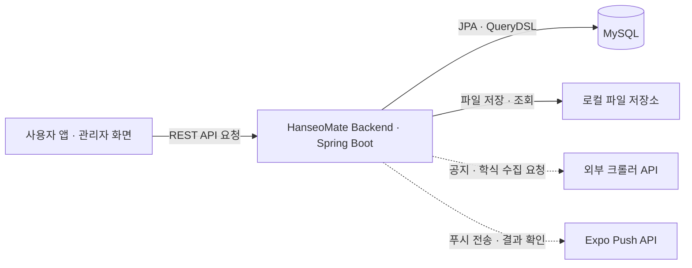
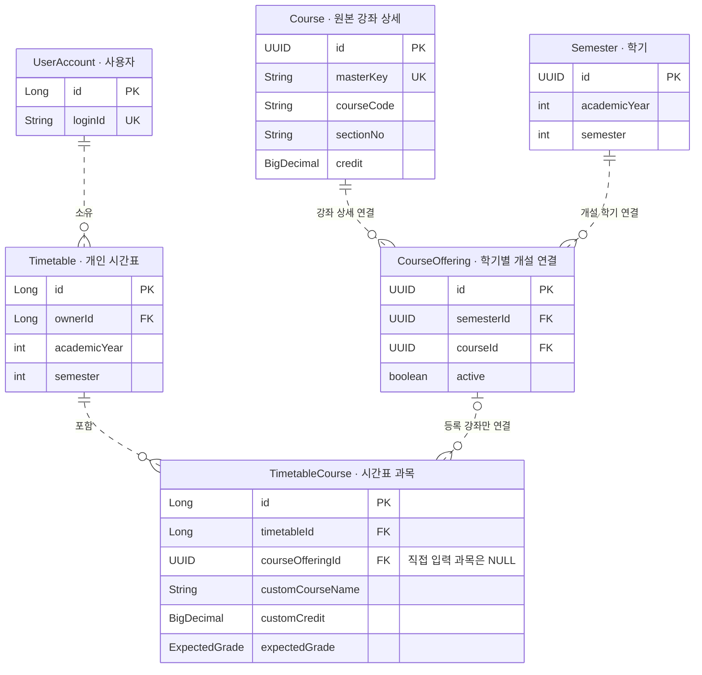

<div align="center">

# 한서메이트 · HanseoMate Backend

**시간표부터 공지·일정·학식까지, 한서대학교 학생을 위한 통합 캠퍼스 서비스**


Java 17 · Spring Boot 4.1.0 · Spring Security · JPA · MySQL

</div>

---

## 프로젝트 소개

한서메이트는 여러 곳에 나뉜 학사 정보와 캠퍼스 생활 정보를 한곳에서 확인할 수 있도록 지원하는 서비스입니다. 이 저장소는 사용자 앱과 관리자 기능이 사용하는 **REST API 백엔드**를 구현합니다.

강좌 Excel 파일을 서비스 데이터로 변환하고, 개인 시간표와 성적을 관리하며, 공지·일정·동아리·학식·캠퍼스 정보를 제공합니다. 관리자는 같은 백엔드를 통해 콘텐츠와 앱 노출 정책을 관리합니다.

백엔드에서는 기능 구현과 함께 다음 문제를 다뤘습니다.

- 원본 강좌가 갱신되어도 **사용자의 시간표와 성적을 보존**하는 데이터 구조
- 동시 요청과 재시도에도 **권한·데이터 규칙을 유지**하는 처리 방식
- DB 변경, 파일 저장, 외부 알림 전송처럼 **성공과 실패의 범위가 다른 작업**의 분리
- 다음 개발자가 변경의 영향을 확인할 수 있는 **테스트와 API 명세**

서비스 화면


### 빠르게 살펴보기

[주요 기능](#주요-기능) · [기술 스택](#기술-스택) · [핵심 설계와 문제 해결](#핵심-설계와-문제-해결) · [프로젝트 구조](#프로젝트-구조) · [아키텍처와 데이터 관리](#아키텍처와-데이터-관리) · [테스트와 검증](#테스트와-검증) · [로컬 실행](#로컬-실행) · [API 문서](#api-문서) · [향후 계획](#향후-계획)

## 주요 기능

| 영역 | 사용자 기능 | 관리자·백엔드 기능 |
|---|---|---|
| 계정 | 회원가입·로그인, 마이페이지, 선호 캠퍼스, 회원탈퇴 | JWT 인증, Refresh Token 회전, 데이터 소유권 확인 |
| 강좌·시간표 | 조건별 강좌 검색, 개인 시간표, 직접 입력 과목 | 전공·교양 Excel 등록, 동일교과목·전공인정 규칙 관리 |
| 성적 | 과목별 예상 성적·학점 수정, 학기·누적 학점 계산 | 원본 강좌와 사용자별 수정값 분리 |
| 일정 | 학교·학생회 일정, 본인 개인 일정, 통합 조회 | 일정 CRUD, 전체 공개 일정 조회 |
| 공지·동아리 | 통합 공지, 첨부파일, 동아리 정보·좋아요·후기 | 학생회·시스템 공지 관리, 동아리 콘텐츠·이미지 관리 |
| 캠퍼스 생활 | 학식, 교내시설·장소, 수업 건물 위치, 버스 시간표 | 장소·이미지·시간표 관리, 외부 크롤러 연동 |
| 홈·앱 정책 | 홈 콘텐츠, 팝업, 필수 링크, 앱 업데이트 확인 | 포스터·팝업·축제 버튼, 앱 업데이트 정책의 게시·예약·롤백 |
| 알림 | 알림함·읽음 처리, 모집·학식·수업 알림 | 기기 연결, 전송 대기 작업 관리, Expo 전송·결과 확인 |

최근에는 **관리자 전체 공개 일정 조회**, **관리자 필수 링크 목록 조회**, **교내시설 주소 자동 저장**, **알림 시각의 한국 시간 응답**을 반영했습니다.

## 기술 스택

| 구분 | 기술 | 적용 내용 |
|---|---|---|
| 실행·빌드 | Java 17, Spring Boot 4.1.0, Gradle Wrapper 9.5.1 | 애플리케이션 구성과 빌드 |
| API | Spring MVC, Bean Validation, springdoc OpenAPI 3.0.3 | 요청 검증, REST API, Swagger 문서 |
| 인증·권한 | Spring Security, OAuth2 Resource Server, JWT, BCrypt | 토큰 인증, 관리자·사용자 권한, 비밀번호 처리 |
| 데이터 | Spring Data JPA, QueryDSL 5.1.0, MySQL | 데이터 관계, 조건 검색, 트랜잭션과 잠금 |
| 파일 | Apache POI 5.5.1, 로컬 파일 저장소 | Excel 해석, 이미지·첨부파일 처리 |
| 외부 연동 | 크롤러 API, Expo Push API | 공지·학식 수집 요청, 푸시 전송 |
| 검증 | JUnit 5, MockMvc, H2, Testcontainers MySQL | 단위·API 통합·DB별 동작 검증 |

> 위 표는 현재 코드에 적용된 기술입니다. CircleCI를 이용한 자동 검증과 PR 연동은 [향후 계획](#향후-계획)으로 구분합니다.

## 핵심 설계와 문제 해결

### 1. 강좌 재등록과 사용자 데이터 보존

**문제**

같은 과목도 학기와 분반에 따라 시간·교수·강의실이 달라집니다. 원본 파일을 다시 등록할 때 기존 강좌를 단순 교체하면 사용자 시간표와 성적에 영향을 줄 수 있습니다.

**구현**

강좌를 학년도·학기·교육과정 유형·과목코드·분반으로 구분하고, 시간표에서는 학기별 개설 정보인 `CourseOffering`의 `offeringId`를 참조합니다. 사용자별 과목명·학점 수정값과 예상 성적은 시간표 과목에 따로 저장합니다.

파일 등록 결과도 `STORED`, `REVIEW_REQUIRED`, `DUPLICATE`로 구분하여 **파일 접수와 실제 데이터 반영을 구별**합니다.

**검증 관점**

같은 학기의 ID 유지, 다른 학기 분리, 중복 파일 처리, 검토가 필요한 파일의 기존 데이터 보존, 사용자 시간표·성적 영향을 확인합니다.

[강좌 등록 서비스](src/main/java/hsu/hanseomate/domain/courseimport/service/CourseImportService.java) · [강좌 API](docs/course-import-api.md) · [데이터 구조 변경 기록](docs/course-offering-dedup-migration.md)

### 2. 토큰 갱신의 동시 요청과 재사용 대응

**문제**

Refresh Token을 반복해서 사용하거나 동시에 갱신하면 인증 상태가 일관되지 않을 수 있습니다. 토큰 원문을 그대로 저장하는 것도 피해야 합니다.

**구현**

Refresh Token은 원문 대신 SHA-256 해시로 저장하고, 갱신 시 행 잠금으로 상태를 확인한 뒤 새 토큰으로 교체합니다. 최초 만료 시각은 유지하며, 이미 교체된 토큰을 재사용하면 같은 토큰 묶음의 활성 토큰을 폐기합니다. 재사용 오류가 발생해도 폐기 결과가 되돌아가지 않도록 트랜잭션 경계를 설정했습니다.

**검증 관점**

정상 갱신, 재사용, 만료, 로그아웃, 탈퇴 후 접근을 확인합니다. 실제 MySQL의 동시 갱신 검증은 별도 Testcontainers 테스트로 구성했습니다.

[인증 서비스](src/main/java/hsu/hanseomate/domain/auth/service/AuthService.java) · [Refresh Token 서비스](src/main/java/hsu/hanseomate/domain/auth/service/RefreshTokenService.java) · [인증 API](docs/auth-api.md)

### 3. 시간표 충돌과 학점 계산의 경계값

**문제**

서로 다른 요청이 같은 시간표에 과목을 추가할 수 있고, 일반 강좌와 직접 입력 과목의 충돌 처리도 구분해야 합니다. 성적 계산에서는 P·F·미입력 값의 의미가 다릅니다.

**구현**

부모 시간표의 행 잠금 아래 소유권과 시간 충돌을 확인합니다. 등록 강좌는 명시적인 교체 정책을 지원하고, 직접 입력 과목은 충돌 시 기존 과목을 삭제하지 않고 거절합니다. 학점은 `BigDecimal`로 계산하며 P는 GPA 분모에서, F는 취득 학점에서 제외합니다.

**검증 관점**

본인·타인 시간표 접근, 중복·충돌·교체, 미입력 성적, 계산 대상이 없는 경우를 확인합니다. 원본 다시 불러오기는 등록 강좌의 과목명·학점 수정값만 초기화하고 예상 성적과 직접 입력 과목은 유지합니다.

[시간표 서비스](src/main/java/hsu/hanseomate/domain/timetable/composition/service/TimetableService.java) · [학점 계산 API](docs/grade-calculator-api.md)

### 4. 알림 저장과 외부 전송의 분리

**문제**

알림을 생성했다고 해서 외부 전송이나 실제 기기 수신까지 성공한 것은 아닙니다. 외부 응답과 내부 처리 상태를 나누어 추적해야 합니다.

**구현**

전송 대기 작업을 DB의 Outbox에 저장하고, 작업 처리기가 활성 기기를 찾아 최대 100개 단위로 Expo에 전송합니다. 전송 접수 결과인 ticket과 후속 결과인 receipt를 구분해 저장·확인합니다. 수업 알림은 과목과 시작 시각을 기준으로 중복 생성을 제어합니다.

**검증 관점**

개인·전체 알림 대상, 만료, 기기 연결 해제, 전송 결과를 구분합니다. 활성 기기가 없어도 `SENT`로 처리되는 경로가 있으므로 해당 상태만으로 실제 수신을 보장하지 않습니다.

[전송 처리기](src/main/java/hsu/hanseomate/domain/push/worker/NotificationSendWorker.java) · [결과 확인 처리기](src/main/java/hsu/hanseomate/domain/push/worker/ReceiptCheckWorker.java) · [수업 알림 API](docs/timetable-class-reminder-api.md)

### 5. 관리자 정책 변경의 충돌과 중복 실행 제어

**문제**

앱 업데이트 정책을 여러 관리자가 수정하거나 같은 요청을 재전송하면 정책이 중복 게시되거나 이전 내용으로 덮어써질 수 있습니다.

**구현**

`revision`으로 오래된 수정을 감지하고, 플랫폼별 잠금으로 게시·예약 충돌을 제어합니다. `Idempotency-Key`로 같은 요청의 결과를 재사용하며 변경 이력을 남깁니다. 롤백은 과거 행을 직접 수정하는 대신 과거 설정을 새 정책으로 복제해 활성화합니다.

**검증 관점**

중복 요청, 다른 내용의 키 재사용, 오래된 revision, 예약 시각, 롤백과 긴급 완화의 차이를 확인합니다.

[정책 서비스](src/main/java/hsu/hanseomate/domain/appupdate/service/AppUpdatePolicyService.java) · [앱 업데이트 정책 API](docs/app-update-policy-api.md)

### 6. DB 변경과 파일 정리의 일관성

**문제**

DB 저장이 실패해도 업로드한 파일은 자동으로 삭제되지 않습니다. 반대로 기존 파일을 먼저 지우면 DB 수정 실패 시 복구가 어려워집니다.

**구현**

DB 변경이 성공하면 이전 파일을 정리하고, 실패하면 해당 요청에서 새로 만든 파일을 정리합니다. 공개 이미지와 일반 첨부파일의 저장·제공 경로를 분리하고, POSIX 지원 환경에서는 공개 이미지의 읽기 권한을 설정합니다.

**검증 관점**

등록·교체·삭제 실패, 고아 파일, 파일 경로와 크기 제한을 확인합니다. 파일 저장 성공과 실제 다운로드 성공은 별도 검증 대상으로 구분합니다.

[학생회 공지 서비스](src/main/java/hsu/hanseomate/domain/studentcouncilnotice/service/StudentCouncilNoticeService.java) · [이미지 저장 서비스](src/main/java/hsu/hanseomate/global/storage/LocalImageStorageService.java) · [학생회 공지 API](docs/student-council-notice-api.md)

## 프로젝트 구조

기능별 패키지 안에서 요청 처리, 업무 규칙, 저장 책임을 분리합니다. 공통 보안·예외·파일 처리는 `global`에서 관리합니다.

```text
src/main/java/hsu/hanseomate/
├── domain/
│   ├── auth, user                       # 계정·인증
│   ├── course, courseimport              # 강좌·Excel 등록
│   ├── courseenrichment                  # 동일교과목·전공인정
│   ├── timetable, gradecalculator        # 시간표·성적
│   ├── calendar, schoolcalendar,
│   │   personalcalendar                 # 일정
│   ├── notices, studentcouncilnotice,
│   │   systemnotice                     # 공지
│   ├── campusmap, cafeteria, busschedule # 캠퍼스 생활
│   ├── club                             # 동아리
│   ├── home, homeposter, popup,
│   │   appsetting, appupdate, essentiallink
│   └── notification, push               # 알림함·전송
└── global/
    ├── security                         # JWT·권한·현재 사용자
    ├── config                           # CORS·공통 설정
    ├── exception                        # 공통 오류
    └── storage                          # 이미지·첨부파일

src/test/                                # 단위·통합 테스트
docs/                                    # API 명세·증분 SQL
```

## 아키텍처와 데이터 관리

현재 저장소의 코드로 확인한 **논리 구조**입니다. 서버 배치·네트워크 구성은 제외하고, 애플리케이션의 역할과 데이터 연결에 집중했습니다.

### 1. 전체 연결 구조

기능별 패키지로 나눈 **단일 Spring Boot 애플리케이션**이 REST API와 예약 작업을 함께 처리합니다. 크롤러와 Expo는 HTTP로 호출하는 외부 시스템입니다.



실선은 요청·데이터 접근 경로, 점선은 외부 HTTP 연동입니다. 화살표는 호출 방향이며, 응답 경로는 생략했습니다.

| 구성 | 코드에서 담당하는 역할 |
|---|---|
| API 처리 | `SecurityFilterChain → Controller → Service → Repository` 순으로 접근 정책, 요청 검증, 업무 규칙, 데이터 조회·저장을 처리 |
| MySQL | 사용자·강좌·콘텐츠 등 서비스 데이터와 알림 전송 대기 작업을 저장. Outbox도 같은 DB의 테이블이며 별도 메시지 서버가 아님 |
| 파일 저장소 | DB에는 파일 URL·메타데이터를, 파일 저장소에는 실제 내용을 저장. 공개 이미지는 `/uploads/**`, 일반 첨부파일은 다운로드 API로 제공 |
| 크롤러 연동 | 공지는 외부 크롤러에 수집 실행을 요청. 학식은 파싱 결과를 응답으로 받아 백엔드에서 검증·저장 |
| 알림 작업 | 애플리케이션 내부 Worker가 DB의 대기 작업을 읽어 Expo에 전송하고, 별도 Worker가 전송 결과를 확인 |

공개 API·로그인 필수 API·관리자 API는 접근 정책이 다릅니다. 개인 데이터의 소유권은 서비스에서도 확인합니다. 크롤러 내부의 수집·저장 구조는 이 저장소의 범위가 아니므로 표시하지 않았습니다.

[보안 설정](src/main/java/hsu/hanseomate/global/security/SecurityConfig.java) · [공지 수집 요청](src/main/java/hsu/hanseomate/domain/notices/service/CrawlOperationService.java) · [학식 동기화](src/main/java/hsu/hanseomate/domain/cafeteria/sync/CafeteriaSyncOrchestrator.java) · [공개 이미지 제공](src/main/java/hsu/hanseomate/global/config/StaticResourceConfig.java)

### 2. 핵심 데이터 관계 — 강좌·시간표·성적

전체 테이블을 나열하는 대신 **학교에서 제공한 강좌와 사용자가 관리하는 시간표·성적의 연결**을 발췌했습니다. 아래 필드는 JPA Entity 기준의 주요 키와 값입니다.



`||`는 반드시 1개, `o|`·`|o`는 0개 또는 1개, `o{`는 0개 이상을 뜻합니다. 관계선은 별도 기본키를 가진 Entity 사이의 참조 관계입니다.

- **원본과 개인 데이터 분리:** 강좌 상세는 `Course`, 사용자별 과목명·학점 수정값과 예상 성적은 `TimetableCourse`에 저장합니다. 개인 수정으로 원본 강좌가 바뀌지 않습니다.
- **학기 구분:** `Course`도 학년도·학기·교육과정 유형·과목코드·분반으로 구분합니다. `CourseOffering`은 해당 강좌와 학기, 등록 이력을 연결하며 API의 `offeringId`가 됩니다.
- **직접 입력 과목:** `courseOffering` 없이 시간표에 연결하며, 과목명·학점·요일·시작 및 종료 시각을 자체 저장합니다. 도식에서는 시간 필드를 생략했습니다.
- **중복 제어:** 사용자·학기별 시간표, 학기·강좌별 개설 정보, 시간표 내 같은 등록 강좌는 복합 유일 제약으로 중복을 제한합니다. `Timetable`의 학기는 연도·학기 값이며 `Semester`에 대한 직접 외래키는 아닙니다.

[강좌 Entity](src/main/java/hsu/hanseomate/domain/course/entity/Course.java) · [개설 정보 Entity](src/main/java/hsu/hanseomate/domain/course/entity/CourseOffering.java) · [시간표 Entity](src/main/java/hsu/hanseomate/domain/timetable/composition/entity/Timetable.java) · [시간표 과목 Entity](src/main/java/hsu/hanseomate/domain/timetable/composition/entity/TimetableCourse.java)

### 3. 데이터별 관리 경계

| 데이터 | 저장·처리 방식 | 유지보수 시 지켜야 할 기준 |
|---|---|---|
| 강좌·개인 시간표 | 원본 강좌와 사용자별 수정값을 분리하고, 같은 학기 재등록 시 기존 ID를 재사용 | 강좌 일괄 삭제로 재등록하지 않고 시간표·성적 참조를 보존 |
| 학교·학생회·개인 일정 | 종류별 테이블에 저장한 뒤 `UnifiedCalendarService`에서 통합 응답 생성 | 관리자 전체 조회는 공개 일정만 포함. 개인 일정은 본인 조회에만 포함하고, 응답 식별에는 `calendarType + id` 사용 |
| 알림함·푸시 작업 | `NotificationService`가 알림함과 Outbox를 같은 트랜잭션으로 저장하고, Worker가 외부 전송 처리 | DB 저장·Expo 접수·후속 전송 결과를 구분. `SENT`만으로 기기 수신을 보장하지 않음 |
| 이미지·첨부파일 | DB의 메타데이터와 파일 저장소의 실제 파일을 연결 | DB 커밋 후 이전 파일 정리, 롤백 시 신규 파일 정리. 공개 이미지와 첨부파일 저장 경로 분리 |

[일정 통합 서비스](src/main/java/hsu/hanseomate/domain/calendar/service/UnifiedCalendarService.java) · [알림 저장 서비스](src/main/java/hsu/hanseomate/domain/push/service/NotificationService.java) · [트랜잭션 이벤트 처리](src/main/java/hsu/hanseomate/domain/push/listener/NotificationEventListener.java)

## 테스트와 검증

정상 응답뿐 아니라 권한, 사용자 데이터 소유권, 중복 요청, 동시 변경, 파일 실패 처리와 시간 경계를 검증합니다.

| 검증 단계 | 목적 |
|---|---|
| 단위 테스트 | Excel 해석, 성적 계산, 입력값과 시간 규칙 확인 |
| API 통합 테스트 | 요청·응답, 인증·권한, 데이터 저장 및 예외 확인 |
| H2 테스트 | 빠른 DB 연동 회귀 검증 |
| MySQL Testcontainers | 실제 MySQL의 잠금·JSON·스키마 등 DB별 동작 확인 |

**검증 기록 — 2026.09.16, 코드 기준 `25d3392`, Windows 로컬 실행**

| 전체 | 통과 | 스킵 | 실패·오류 |
|---:|---:|---:|---:|
| 670 | 649 | 21 | 0 |

스킵 21건은 MySQL Testcontainers 환경 19건, 실제 원본 파일을 사용하는 테스트 1건, POSIX 파일 권한 테스트 1건입니다. **스킵을 통과에 포함하지 않았으며**, H2 결과를 실제 MySQL이나 운영 환경의 검증으로 해석하지 않습니다.

```powershell
.\gradlew.bat test
.\gradlew.bat test --tests "*UnifiedCalendarApiIntegrationTest"
```

테스트 보고서: `build/reports/tests/test/index.html`

> 위 수치는 명시된 기준 버전의 로컬 실행 기록입니다. 현재 브랜치에서는 다시 실행하여 확인해야 합니다. 외부 크롤러의 실제 수집, Expo·휴대전화 수신, 운영 배포는 이 결과에 포함되지 않습니다.

## 로컬 실행

JDK 17과 로컬 MySQL이 필요합니다. 아래는 **개발용 실행 안내**이며 운영 배포 절차가 아닙니다.

<details>
<summary>설정과 실행 명령 펼치기 — PowerShell</summary>

### 1. 개발용 DB 생성

```sql
CREATE DATABASE hanseo_mate
    CHARACTER SET utf8mb4
    COLLATE utf8mb4_unicode_ci;
```

### 2. 필수 설정과 실행

`local` 프로필의 DB 계정·비밀번호는 비어 있으므로 `SPRING_DATASOURCE_USERNAME`과 `SPRING_DATASOURCE_PASSWORD`로 지정합니다. `DB_URL`을 생략하면 로컬 `hanseo_mate` DB에 연결합니다.

```powershell
$env:SPRING_DATASOURCE_USERNAME="root"
$env:SPRING_DATASOURCE_PASSWORD="로컬-DB-비밀번호"
$env:JWT_SECRET="local-only-change-this-32-byte-secret"

$appArgs = @(
  "--spring.profiles.active=local"
  "--crawler.api.base-url=http://127.0.0.1:8000"
  "--cafeteria.crawler.api-base-url=http://127.0.0.1:8000"
  "--cafeteria.crawler.main-student-url=http://127.0.0.1/main-student"
  "--cafeteria.crawler.main-staff-url=http://127.0.0.1/main-staff"
  "--cafeteria.crawler.taean-student-url=http://127.0.0.1/taean-student"
  "--cafeteria.crawler.taean-staff-url=http://127.0.0.1/taean-staff"
  "--app.updates.scheduler-enabled=false"
  "--app.timetable-reminder.enabled=false"
)
.\gradlew.bat bootRun "--args=$($appArgs -join ' ')"
```

- JWT 키와 비밀번호는 개발 전용 값으로 지정합니다.
- 학식 원본 URL 4개는 기동에 필요한 **예시 값**입니다. 실제 동기화에는 유효한 원본 URL과 별도 크롤러가 필요합니다.
- 위 옵션은 앱 정책·수업 알림 작업을 비활성화합니다. 다른 자동 실행 작업까지 모두 중지하는 설정은 아닙니다.
- `.env.example` 복사만으로 Spring이 환경변수를 자동으로 읽지는 않습니다.
- 이 명령은 코드·설정에 근거한 안내이며, 위 테스트 기록과 별개로 실제 로컬 MySQL 연결을 확인해야 합니다.

### 3. 정상 동작 확인

| 확인 대상 | 주소·기대 결과 |
|---|---|
| 상태 확인 | `GET http://localhost:8080/actuator/health` → `200`, `UP` |
| Swagger UI | `http://localhost:8080/swagger-ui.html` |
| OpenAPI | `http://localhost:8080/v3/api-docs` |
| 공개 API | `GET /api/links` → 빈 DB에서는 `200`, `[]` |
| 관리자 권한 | 토큰 없이 `/api/admin/links` 요청 → `401` |

### 4. DB·파일 저장 주의사항

- `local`은 `ddl-auto=update`, `prod`는 `validate`입니다. 운영에서는 애플리케이션이 스키마를 변경하지 않습니다.
- [기준 스키마 SQL](docs/database-schema-mysql.sql)은 현재 모든 Entity 테이블을 포함하지 않습니다. 이 파일 하나로 전체 DB가 구성된다고 가정하지 말고 기능별 증분 SQL과 실제 스키마를 대조해야 합니다.
- 기존 DB는 백업과 사전 확인 후 필요한 변경만 적용합니다. 강좌·시간표 데이터를 일괄 초기화하는 방식으로 대체하지 않습니다.
- 건물 좌표·장소 등의 초기 데이터는 별도입니다. [건물 좌표 SQL](docs/campus-building-location-migration-mysql.sql)의 사전 점검과 seed 적용 조건을 확인합니다.
- 이미지 저장 위치는 `UPLOAD_DIRECTORY`, 공개 URL은 `UPLOAD_PUBLIC_BASE_URL`, 일반 첨부파일 위치는 `NOTICE_ATTACHMENT_DIRECTORY`로 설정합니다.
- 운영 프로필의 DB 환경변수는 `DB_URL`, `DB_USERNAME`, `DB_PASSWORD`입니다. Swagger·OpenAPI는 운영에서 기본 비활성화됩니다.

</details>

## API 문서

요청·응답, 오류, 파일 제한, 데이터 변경 전제는 기능별 문서에서 확인할 수 있습니다.

| 영역 | 상세 명세 |
|---|---|
| 계정 | [인증](docs/auth-api.md) · [마이페이지](docs/my-page-api.md) |
| 강좌 | [강좌 등록·검색](docs/course-import-api.md) · [학사 규칙 보강](docs/course-enrichment-api.md) |
| 시간표·성적 | [시간표](docs/timetable-api.md) · [학점 계산](docs/grade-calculator-api.md) · [수업 알림](docs/timetable-class-reminder-api.md) |
| 일정 | [학생회](docs/calendar-api.md) · [학교](docs/school-calendar-api.md) · [개인](docs/personal-calendar-api.md) · [통합 조회](docs/unified-calendar-api.md) |
| 공지·동아리 | [학교 공지](docs/notice-api.md) · [학생회 공지](docs/student-council-notice-api.md) · [시스템 공지](docs/system-notice-api.md) · [동아리](docs/club-api.md) |
| 캠퍼스 | [장소·수업 위치](docs/campus-map-api.md) · [학식](docs/cafeteria-api.md) · [버스](docs/bus-schedule-api.md) |
| 홈·콘텐츠 | [홈](docs/home-api.md) · [포스터](docs/home-poster-api.md) · [팝업](docs/app-popup-api.md) · [필수 링크](docs/essential-link-api.md) |
| 앱 정책 | [축제 버튼](docs/festival-floating-button-api.md) · [앱 업데이트 정책](docs/app-update-policy-api.md) |
| 알림 | [알림함](docs/notification-api-spec.md) · [학식 알림](docs/cafeteria-push-notification-spec.md) |

### 관리자 일정 조회의 구분

| API | 권한 | 조회 범위 |
|---|---|---|
| `GET /api/admin/calendars` | ADMIN | 학생회 일정 |
| `GET /api/admin/calendars/all` | ADMIN | 학교 공식 + 학생회 일정, 개인 일정 제외 |
| `GET /api/calendars/all` | 선택 로그인 | 학교·학생회 일정, 로그인 시 본인 개인 일정 추가 |

통합 응답에서는 일정 종류별 숫자 ID가 겹칠 수 있으므로 `calendarType`과 `id`를 함께 사용합니다.

## 개발·협업 방식

```text
feature/* → develop → main
           PR         PR
```

변경은 기능 브랜치에서 진행하고, PR에 변경 목적·영향 범위·검증 결과·DB 변경 여부를 기록합니다. API 변경 시 명세와 관련 테스트를 함께 갱신하며, 코드 병합과 실제 DB 적용·서버 배포는 별도 단계로 구분합니다.

## 향후 계획

**2026년 내 추진할 개발 체계와 개선 방향입니다. 아래 항목은 현재 구현 완료된 기능이 아닙니다.**

- [ ] CircleCI에서 코드 변경 시 빌드·테스트를 자동 실행하고 결과를 PR에 연결
- [ ] 필수 검증을 통과한 변경만 병합할 수 있도록 검토 절차와 브랜치 보호 설정 정비
- [ ] 실제 MySQL 테스트 실행 환경을 마련하고 실패·스킵 결과를 구분하여 기록
- [ ] 기준 스키마와 증분 SQL을 정리하여 새 환경의 DB 재현성 확보
- [ ] 알림의 기기 소유권 확인, 입력 검증과 업로드 요청 제한 보강

현재의 코드·명세 중심 인수인계를 넘어, 다음 개발자도 같은 절차로 **수정하고 검증하고 반영할 수 있는 개발 체계**를 갖추는 것이 목표입니다.
